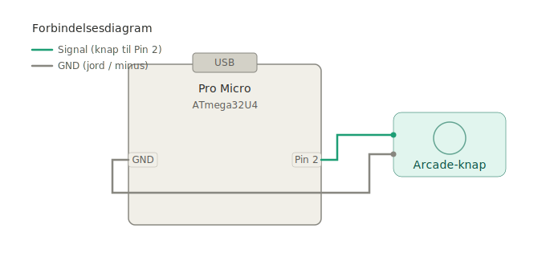

# Arcade-Knap som USB-Museklik — Simpel Version

**Board:** Pro Micro klon (ATmega32U4 / Binghe 3)

I dette projekt bygger du en arcade-knap, der fungerer som et rigtigt museklik på din computer. Hver gang du trykker på knappen, sender den et venstreklik — præcis som om du klikkede med en rigtig mus. Ingen drivere, ingen programmer — det virker bare!

---

## Hvad Kan Den?

- **Tryk på knappen** — sender ét venstreklik med musen
- **Plug and play** — computeren tror det er en rigtig mus, ingen installation nødvendig
- **Debouncing** — koden sørger for at hvert tryk kun tæller som ét klik, selvom kontakterne ryster

---

## Hvad Skal Du Bruge?

| Del | Antal | Bemærkning |
|-----|-------|------------|
| Pro Micro (ATmega32U4) | 1 | 5V/16MHz eller 3.3V/8MHz klon |
| Arcade-knap med mikroswitch | 1 | F.eks. Sanwa, Cherry eller lignende |
| Ledninger | Lidt | Til at forbinde knap og board |

> **Tip:** Alle disse dele kan købes billigt fra elektronikbutikker eller online. Et "Arduino starter kit" indeholder ofte det meste.

Det er alt! Denne version kræver ingen LED, ingen modstande og intet potentiometer.

---

## Sådan Forbinder Du Det Hele (Wiring)

Her er en oversigt over hvad der skal forbindes til hvad. Det er kun to ledninger — så det er svært at gøre forkert!



### Arcade-Knappen

En arcade-knap har typisk en mikroswitch indeni med to terminaler (ben).

| Knappens ben | Forbindes til |
|--------------|---------------|
| Ben 1 | Pro Micro **Pin 2** |
| Ben 2 | Pro Micro **GND** |

> **Hvad er GND?** GND betyder "ground" (jord) — det er minuspolen. Din Pro Micro har flere GND-pins, og det er lige meget hvilken du bruger.

Du behøver **ingen ekstra modstand** til knappen. Koden tænder en modstand inde i chippen automatisk (det hedder en "pull-up modstand").

Din mappestruktur ser sådan ud:

```
ArcadeMouseClick_Simple/
├── ArcadeMouseClick_Simple.ino
└── README.md
```

---

## Opsætning af Arduino IDE (Programmet)

Før du kan sende koden til boardet, skal du sætte Arduino IDE rigtigt op:

### Trin 1: Installer Arduino IDE

Hvis du ikke allerede har det, download det gratis fra [arduino.cc](https://www.arduino.cc/en/software) og installer det.

### Trin 2: Tilføj Pro Micro Board-Support

Din Pro Micro er ikke med i Arduino IDE fra starten, så du skal tilføje det:

1. Åbn Arduino IDE
2. Gå til **File → Preferences** (eller **Fil → Indstillinger**)
3. Find feltet **"Additional Board Manager URLs"**
4. Indsæt denne adresse:
   ```
   https://raw.githubusercontent.com/sparkfun/Arduino_Boards/master/IDE_Board_Manager/package_sparkfun_index.json
   ```
5. Klik **OK**
6. Gå til **Tools → Board → Boards Manager** (eller **Værktøjer → Board → Boards Manager**)
7. Søg efter **"SparkFun"** og installer **SparkFun AVR Boards**

### Trin 3: Vælg Det Rigtige Board

1. Gå til **Tools → Board** og vælg **SparkFun Pro Micro**
2. Under **Tools → Processor** vælg:
   - `ATmega32U4 (5V, 16MHz)` — dette er den mest almindelige
   - `ATmega32U4 (3.3V, 8MHz)` — kun hvis du har en 3.3V version

### Trin 4: Vælg Porten

1. Sæt Pro Micro i computeren med USB-kablet
2. Gå til **Tools → Port** og vælg den port der dukker op (f.eks. COM3 på Windows eller /dev/ttyACM0 på Linux)

> **Bemærk:** Når du uploader til en 32U4-board, forsvinder porten kort og kommer tilbage igen. Det er helt normalt!

### Trin 5: Upload Koden

1. Åbn filen `ArcadeMouseClick_Simple.ino` i Arduino IDE
2. Klik på **Upload**-knappen (pilen der peger til højre)
3. Vent til der står "Done uploading" i bunden

**Nu er dit board en mus!** Prøv at trykke på arcade-knappen — du bør se et museklik på din computer.

---

## Sådan Virker Koden (Forklaring)

Her gennemgår vi hvad de forskellige dele af koden gør. Du behøver ikke forstå alt med det samme — det vigtigste er at det virker! Men det er godt at vide hvad der sker, så du kan ændre ting selv senere.

### Inkludering af Mouse-Biblioteket

```cpp
#include <Mouse.h>
```

Denne linje fortæller Arduino IDE at vi vil bruge `Mouse`-biblioteket. Det er et bibliotek der følger med Arduino IDE og som lader ATmega32U4-chippen opføre sig som en USB-mus. Uden denne linje ville koden ikke vide hvad `Mouse.click()` betyder.

### Pin-Opsætning

```cpp
const int buttonPin = 2;
```

Her fortæller vi koden at vores arcade-knap sidder på pin 2. Hvis du bruger en anden pin, skal du ændre tallet her. `const` betyder at værdien ikke kan ændres mens programmet kører — det er bare en fast indstilling.

### Tilstandsvariabler

```cpp
bool lastButtonState = HIGH;
unsigned long lastDebounceTime = 0;
unsigned long debounceDelay = 30;
bool stableState = HIGH;
```

Disse variabler holder styr på knappens tilstand:

| Variabel | Hvad den gør |
|----------|-------------|
| `lastButtonState` | Husker hvad knappen læste sidst (HIGH = ikke trykket) |
| `lastDebounceTime` | Tidspunktet da knappen sidst ændrede sig |
| `debounceDelay` | Hvor lang tid vi venter for at undgå rystelser (30 millisekunder) |
| `stableState` | Den "rigtige" tilstand vi stoler på, efter rystelserne er forbi |

### `setup()` — Det der sker én gang ved opstart

```cpp
void setup() {
  pinMode(buttonPin, INPUT_PULLUP);
  Mouse.begin();
}
```

`setup()` kører én enkelt gang når boardet tændes eller nulstilles. Den gør to ting:

**`pinMode(buttonPin, INPUT_PULLUP)`** — sætter pin 2 som en indgang og tænder den interne pull-up modstand. Pull-up modstanden holder pinnen på HIGH (tændt) når knappen IKKE er trykket. Når du trykker, forbindes pinnen til GND, og den skifter til LOW (slukket). Uden pull-up ville pinnen "flyde" og give tilfældige aflæsninger.

**`Mouse.begin()`** — starter USB-mus funktionen. Fra dette øjeblik tror computeren at dit board er en mus.

> **Vigtigt:** Når `Mouse.begin()` kører, er boardet en mus. Hvis noget går galt og den klikker i vilden sky, kan det være svært at omprogrammere. Se afsnittet "Fejlfinding" for hvordan du løser det.

### `loop()` — Det der gentages hele tiden

```cpp
void loop() {
  bool reading = digitalRead(buttonPin);
```

`loop()` kører igen og igen — mange tusinde gange i sekundet. Første ting den gør er at læse knappens tilstand med `digitalRead()`. Resultatet er enten `HIGH` (ikke trykket) eller `LOW` (trykket).

### Debounce — Filtrering af rystelser

```cpp
  if (reading != lastButtonState) {
    lastDebounceTime = millis();
  }
```

Hvis aflæsningen er anderledes end sidst, nulstiller vi debounce-timeren. `millis()` returnerer hvor mange millisekunder der er gået siden boardet blev tændt.

**Hvorfor gør vi det?** Når du trykker på en knap, rører metalkontakterne inde i switchen hinanden. Men de "bouncer" — de ryster hurtigt frem og tilbage i nogle få millisekunder, ligesom en bold der rammer gulvet. Computeren er hurtig nok til at se disse rystelser som mange tryk.

```cpp
  if ((millis() - lastDebounceTime) > debounceDelay) {
    if (reading != stableState) {
      stableState = reading;
```

Vi tjekker om der er gået mere end 30 millisekunder siden sidste ændring. Hvis ja, stoler vi på at aflæsningen nu er stabil og rigtig. Vi opdaterer `stableState` til den nye værdi.

### Send museklikket

```cpp
      if (stableState == LOW) {
        Mouse.click(MOUSE_LEFT);
      }
```

Hvis den nye stabile tilstand er `LOW` (knappen er trykket ned), sender vi et venstreklik. Vi klikker kun på **tryk ned**, ikke på slip — ellers ville hvert tryk give to klik.

`Mouse.click(MOUSE_LEFT)` sender et komplet museklik (tryk + slip) over USB. Computeren kan ikke se forskel på dette og et rigtigt museklik.

### Gem tilstanden til næste gang

```cpp
  lastButtonState = reading;
}
```

Til sidst gemmer vi den aktuelle aflæsning, så vi kan sammenligne med den næste gang `loop()` kører.

---

## Overblik: Hvad sker der i koden?

```
loop() starter (kører tusindvis af gange i sekundet)
  │
  ├─ Læs knappen → HIGH eller LOW?
  │
  ├─ Har den ændret sig?
  │    ├─ Ja → Nulstil debounce-timer
  │    └─ Nej → Gør ingenting
  │
  ├─ Er der gået 30ms siden sidste ændring?
  │    ├─ Nej → Vent videre (der kan stadig være rystelser)
  │    └─ Ja → Stol på aflæsningen
  │         │
  │         └─ Er knappen trykket ned (LOW)?
  │              ├─ Ja → Send Mouse.click(MOUSE_LEFT)!
  │              └─ Nej → Knappen er sluppet, gør ingenting
  │
  └─ Gem aflæsningen → start forfra
```

---

## Ting Du Kan Ændre

| Hvad vil du ændre? | Variabel i koden | Standard |
|--------------------|------------------|----------|
| Hvilken pin knappen sidder på | `buttonPin` | 2 |
| Debounce-tid (hvis du får dobbelt-klik) | `debounceDelay` | 30ms |

Du kan også ændre `MOUSE_LEFT` til `MOUSE_RIGHT` for højreklik, eller `MOUSE_MIDDLE` for midterklik.

---

## Fejlfinding

| Problem | Løsning |
|---------|---------|
| Knappen klikker to gange per tryk | Skru `debounceDelay` op til 40 eller 50 |
| Ingenting sker når jeg trykker | Tjek at ledningerne sidder i Pin 2 og GND |
| Boardet klikker hele tiden uden at jeg trykker | Ledningen til Pin 2 er løs eller sidder forkert — tjek forbindelserne |
| Boardet klikker i vilden sky og kan ikke omprogrammeres | Nogle Pro Micro boards har en reset-knap — dobbeltklik på den hurtigt og upload med det samme. Hvis den ikke har en, forbind RST til GND kort med en ledning for at nulstille |
| Arduino IDE kan ikke finde boardet | Tjek at du har valgt den rigtige processor (5V/16MHz) under Tools → Processor |
| "Mouse was not declared" fejl | Tjek at du har valgt SparkFun Pro Micro som board — Mouse-biblioteket virker kun med 32U4-boards |

---

## Næste Skridt — Idéer Til Udvidelser

Når du har fået det til at virke, er her nogle ting du kan prøve:

- **Tilføj auto-fire** — se den avancerede version af dette projekt med potentiometer og LED
- **Tilføj en knap mere** til højreklik (`MOUSE_RIGHT`)
- **Tilføj tastatur-tryk** med `Keyboard.h` biblioteket (samme board understøtter det)
- **Byg en hel arcade-controller** med flere knapper og en joystick
- **3D-print eller byg en kasse** til det hele

God fornøjelse med byggeriet! 🕹️
