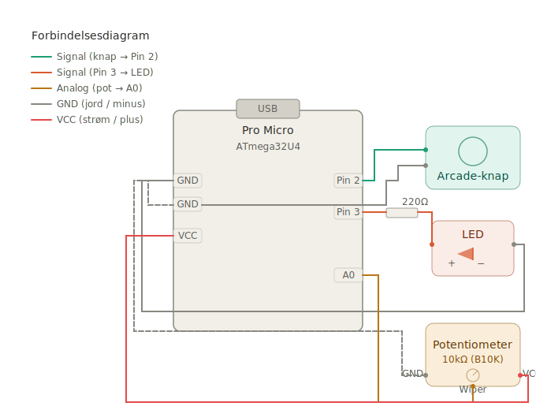

# Arcade-Knap som USB-Museklik — Med Auto-Fire!

**Board:** Pro Micro klon (ATmega32U4 / Binghe 3)

I dette projekt bygger du en arcade-knap, der fungerer som et rigtigt museklik på din computer. Du kan også aktivere **auto-fire**, så den klikker igen og igen helt af sig selv — og du styrer hastigheden med et drejepotentiometer (en lille skruekontakt).

En LED lyser, når auto-fire er tændt, så du altid kan se hvad der sker.

---

## Hvad Kan Den?

- **Kort tryk** — sender ét venstreklik med musen
- **Hold knappen i 3 sekunder** — tænder auto-fire (den bliver ved med at klikke, også efter du slipper)
- **Tryk igen** — slukker auto-fire med det samme
- **Drejepotentiometer** — skru op og ned for klikhastigheden mens auto-fire kører
- **LED-lys** — lyser når auto-fire er aktiv, blinker 3 gange når den tændes
- **Sikkerhedsfunktion** — hold knappen nede mens du sætter USB-kablet i, så slukker museknappen helt (smart hvis noget går galt)

---

## Hvad Skal Du Bruge?

| Del | Antal | Bemærkning |
|-----|-------|------------|
| Pro Micro (ATmega32U4) | 1 | 5V/16MHz eller 3.3V/8MHz klon |
| Arcade-knap med mikroswitch | 1 | F.eks. Sanwa, Cherry eller lignende |
| 10kΩ potentiometer | 1 | Lineær type (kaldet "B10K") er bedst |
| LED (valgfri farve) | 1 | En helt normal 3mm eller 5mm LED |
| 220Ω modstand | 1 | Beskytter LED'en mod for meget strøm |
| Ledninger | Lidt | Til at forbinde det hele |

> **Tip:** Alle disse dele kan købes billigt fra elektronikbutikker eller online. Et "Arduino starter kit" indeholder ofte det meste.

---

## Sådan Forbinder Du Det Hele (Wiring)



Her er en oversigt over hvad der skal forbindes til hvad. Tag dig god tid — det er vigtigt at det sidder rigtigt.

### Arcade-Knappen

En arcade-knap har typisk en mikroswitch indeni med to terminaler (ben).

| Knappens ben | Forbindes til |
|--------------|---------------|
| Ben 1 | Pro Micro **Pin 2** |
| Ben 2 | Pro Micro **GND** |

> **Hvad er GND?** GND betyder "ground" (jord) — det er minuspolen. Din Pro Micro har flere GND-pins, og det er lige meget hvilken du bruger.

Du behøver **ingen ekstra modstand** til knappen. Koden tænder en modstand inde i chippen automatisk (det hedder en "pull-up modstand").

### LED'en (Auto-Fire Indikator)

En LED har to ben — et langt og et kort:
- **Det lange ben** = plus (+), kaldes "anode"
- **Det korte ben** = minus (−), kaldes "katode" (der er også en flad kant på LED-huset på denne side)

Forbind den sådan her:

```
Pro Micro Pin 3 → 220Ω modstand → LED langt ben (+) → LED kort ben (−) → GND
```

| LED-ben | Forbindes til |
|---------|---------------|
| Langt ben (+) anode | Pro Micro **Pin 3** (gennem 220Ω modstand) |
| Kort ben (−) katode | Pro Micro **GND** |

> **Hvorfor en modstand?** En LED kan ikke klare 5 volt direkte — den brænder af! Modstanden på 220Ω begrænser strømmen, så LED'en lyser pænt uden at gå i stykker. Tænk på det som en vandhane der skruer ned for trykket.

> **Hvis LED'en ikke lyser:** Prøv at vende den om. LED'er virker kun i én retning — det er helt normalt at man sætter den forkert første gang.

### Potentiometeret (Hastighedskontrol)

Et potentiometer har 3 ben. Det midterste ben er det vigtige — det er "wiperen" som ændrer spænding når du drejer.

| Pot-ben | Forbindes til |
|---------|---------------|
| Venstre ydre ben | Pro Micro **GND** |
| Midterste ben (wiper) | Pro Micro **A0** |
| Højre ydre ben | Pro Micro **VCC** |

> **Hvad er VCC?** VCC er pluspolen — den giver strøm ud (5V eller 3.3V afhængig af dit board).

> **Drejer den den forkerte vej?** Hvis det bliver langsommere når du drejer til højre, skal du bare bytte om på GND og VCC ledningerne på de to ydre ben. Problemet løst!

---

## Opsætning af Arduino IDE (Programmet)

Før du kan sende koden til boardet, skal du sætte Arduino IDE rigtigt op:

### Trin 1: Installer Arduino IDE

Hvis du ikke allerede har det, download det gratis fra [arduino.cc](https://www.arduino.cc/en/software) og installer det.

### Trin 2: Tilføj Pro Micro Board-Support

Din Pro Micro er ikke med i Arduino IDE fra starten, så du skal tilføje det:

1. Åbn Arduino IDE
2. Gå til **File → Preferences** (eller **Fil → Indstillinger**)
3. Find feltet **"Additional Board Manager URLs"**
4. Indsæt denne adresse:
   ```
   https://raw.githubusercontent.com/sparkfun/Arduino_Boards/master/IDE_Board_Manager/package_sparkfun_index.json
   ```
5. Klik **OK**
6. Gå til **Tools → Board → Boards Manager** (eller **Værktøjer → Board → Boards Manager**)
7. Søg efter **"SparkFun"** og installer **SparkFun AVR Boards**

### Trin 3: Vælg Det Rigtige Board

1. Gå til **Tools → Board** og vælg **SparkFun Pro Micro**
2. Under **Tools → Processor** vælg:
   - `ATmega32U4 (5V, 16MHz)` — dette er den mest almindelige
   - `ATmega32U4 (3.3V, 8MHz)` — kun hvis du har en 3.3V version

### Trin 4: Vælg Porten

1. Sæt Pro Micro i computeren med USB-kablet
2. Gå til **Tools → Port** og vælg den port der dukker op (f.eks. COM3 på Windows eller /dev/ttyACM0 på Linux)

> **Bemærk:** Når du uploader til en 32U4-board, forsvinder porten kort og kommer tilbage igen. Det er helt normalt!

### Trin 5: Upload Koden

1. Åbn filen `ArcadeMouseClick.ino` i Arduino IDE
2. Klik på **Upload**-knappen (pilen der peger til højre)
3. Vent til der står "Done uploading" i bunden

**Nu er dit board en mus!** Prøv at trykke på arcade-knappen — du bør se et museklik på din computer.

---

## Sådan Virker Koden (Forklaring)

Her gennemgår vi hvad de forskellige dele af koden gør. Du behøver ikke forstå alt med det samme — det vigtigste er at det virker! Men det er godt at vide hvad der sker, så du kan ændre ting selv senere.

### Pin-Opsætning

```cpp
const int buttonPin = 2;
const int ledPin    = 3;
const int potPin    = A0;
```

Her fortæller vi koden hvilke pins vi har forbundet vores dele til. Hvis du bruger andre pins, skal du ændre tallene her.

### Hastighedsgrænser

```cpp
const unsigned long AUTO_FIRE_MIN_INTERVAL = 30;   // Hurtigst (millisekunder mellem klik)
const unsigned long AUTO_FIRE_MAX_INTERVAL = 500;   // Langsomst (millisekunder mellem klik)
```

Disse tal bestemmer hvor hurtigt og langsomt auto-fire kan klikke:

| Interval | Hvad det betyder |
|----------|-----------------|
| 30ms (hurtigst) | Ca. 33 klik i sekundet — vildt hurtigt! |
| 100ms | Ca. 10 klik i sekundet |
| 250ms | Ca. 4 klik i sekundet |
| 500ms (langsomst) | Ca. 2 klik i sekundet |

Du kan ændre disse tal. Prøv f.eks. at sætte minimum til 50 og maximum til 1000 og se hvordan det føles.

### Hold-Tid

```cpp
const unsigned long HOLD_THRESHOLD = 3000;  // 3 sekunder (3000 millisekunder)
```

Så lang tid skal du holde knappen nede for at tænde auto-fire. 3 sekunder er valgt så du ikke tænder det ved et uheld. Hvis det føles for langsomt, prøv 2000 (2 sekunder).

### Debouncing (Fjerner Rystelser)

```cpp
const unsigned long DEBOUNCE_DELAY = 30;
```

Når du trykker på en knap, rører metalkontakterne inde i switchen hinanden. Men de "bouncer" — de ryster hurtigt frem og tilbage i nogle få millisekunder, ligesom en bold der rammer gulvet. Computeren er hurtig nok til at se disse rystelser som mange tryk.

Debounce-koden ignorerer signalet i 30 millisekunder efter første tryk, så kun ét rent tryk registreres. Hvis du oplever at den klikker to gange, prøv at ændre tallet til 40 eller 50.

### `INPUT_PULLUP` — Den Interne Modstand

```cpp
pinMode(buttonPin, INPUT_PULLUP);
```

Denne linje gør to ting:
1. Sætter pin 2 som en **indgang** (den læser signal i stedet for at sende)
2. Tænder en **pull-up modstand** inde i chippen

Pull-up modstanden holder pinnen på HIGH (tændt) når knappen IKKE er trykket. Når du trykker, forbindes pinnen til GND, og den skifter til LOW (slukket). Uden pull-up ville pinnen "flyde" og give tilfældige aflæsninger.

### LED-Blink Funktion

```cpp
void blinkLed(int count, unsigned long duration) {
  for (int i = 0; i < count; i++) {
    digitalWrite(ledPin, HIGH);
    delay(duration);
    digitalWrite(ledPin, LOW);
    delay(duration);
  }
}
```

Denne funktion blinker LED'en et bestemt antal gange. Den bruges kun i det øjeblik auto-fire aktiveres — LED'en blinker 3 gange hurtigt så du kan se at det virkede.

### Sikkerhedsfunktionen (Bail-Out)

```cpp
delay(500);
if (digitalRead(buttonPin) == LOW) {
  mouseEnabled = false;
  return;
}
Mouse.begin();
```

**Dette er vigtigt at forstå!** Så snart `Mouse.begin()` kører, tror computeren at dit board er en mus. Hvis koden har en fejl og klikker hele tiden, kan det være svært at åbne Arduino IDE og uploade ny kode, fordi musen går amok.

Sikkerhedsfunktionen tjekker om du holder knappen nede mens boardet starter op. Hvis ja, aktiverer den **aldrig** museknappen — boardet gør ingenting, og du kan uploade ny kode i fred og ro.

**Sådan bruger du bail-out:**
1. Hold arcade-knappen nede
2. Sæt USB-kablet i (mens du stadig holder)
3. Vent 1 sekund
4. Slip knappen
5. Nu er boardet i sikker tilstand — upload din nye kode

### Knap-Logikken (State Machine)

Koden holder styr på hvad knappen gør med disse variabler:

| Variabel | Hvad den holder styr på |
|----------|------------------------|
| `stableState` | Om knappen er trykket (LOW) eller sluppet (HIGH) lige nu |
| `buttonIsHeld` | Om knappen holdes nede lige nu |
| `holdTriggeredAuto` | Om dette hold allerede har tændt auto-fire |
| `autoFireActive` | Om auto-fire kører lige nu |
| `mouseEnabled` | Om musen overhovedet er aktiv (false = bail-out) |

**Når du trykker knappen ned:**
- Hvis auto-fire allerede kører → **sluk den**, LED går ud
- Hvis auto-fire ikke kører → start en timer og vent

**Når du slipper knappen:**
- Hvis det var et kort tryk → send ét museklik
- Hvis du holdt i 3 sekunder (auto-fire blev tændt) → send IKKE et ekstra klik

**Mens du holder knappen:**
- Tæl tiden. Når den rammer 3 sekunder → tænd auto-fire, blink LED 3 gange, tænd LED

### Potentiometer-Aflæsning

```cpp
int potValue = analogRead(potPin);
unsigned long clickInterval = map(potValue, 0, 1023, AUTO_FIRE_MIN_INTERVAL, AUTO_FIRE_MAX_INTERVAL);
```

`analogRead()` læser potentiometeret og giver et tal mellem 0 og 1023 (0 = skruet helt den ene vej, 1023 = helt den anden vej).

`map()` oversætter dette tal til vores hastighedsinterval. Så potentiometeret kontrollerer direkte hvor hurtigt auto-fire klikker.

Potentiometeret aflæses **hele tiden** mens auto-fire kører, så du kan justere hastigheden i realtid bare ved at dreje på knappen.

### `Mouse.click(MOUSE_LEFT)`

```cpp
Mouse.click(MOUSE_LEFT);
```

Denne linje sender et komplet museklik (tryk + slip) over USB. Computeren kan ikke se forskel på dette og et rigtigt museklik. Der skal ingen drivere eller programmer installeres — det virker bare!

---

## Overblik: Sådan Fungerer Det Hele Sammen

```
STANDBY (LED slukket)
  │
  ├─ Kort tryk + slip → Ét museklik → tilbage til STANDBY
  │
  └─ Hold i 3 sekunder → LED blinker 3 gange → LED lyser fast
        │
        AUTO-FIRE AKTIV (LED lyser)
        │  Klikker med den hastighed potentiometeret er sat til
        │  Du kan dreje på potentiometeret mens den kører
        │
        └─ Tryk på knappen → LED slukker → tilbage til STANDBY
```

---

## Ting Du Kan Ændre

| Hvad vil du ændre? | Variabel i koden | Standard |
|--------------------|------------------|----------|
| Hurtigste auto-fire | `AUTO_FIRE_MIN_INTERVAL` | 30ms (~33 klik/sek) |
| Langsomste auto-fire | `AUTO_FIRE_MAX_INTERVAL` | 500ms (~2 klik/sek) |
| Tid for at aktivere | `HOLD_THRESHOLD` | 3000ms (3 sekunder) |
| Knap-pin | `buttonPin` | 2 |
| LED-pin | `ledPin` | 3 |
| Potentiometer-pin | `potPin` | A0 |
| Debounce-tid | `DEBOUNCE_DELAY` | 30ms |
| Antal blink ved aktivering | `BLINK_COUNT` | 3 |
| Blinkhastighed | `BLINK_DURATION` | 80ms |

---

## Fejlfinding

| Problem | Løsning |
|---------|---------|
| Knappen klikker to gange | Skru `DEBOUNCE_DELAY` op til 40–50 |
| Auto-fire tænder ved uheld | Skru `HOLD_THRESHOLD` op (prøv 4000–5000) |
| Potentiometeret drejer den forkerte vej | Byt GND og VCC ledningerne på de ydre ben |
| LED'en lyser ikke | Tjek polariteten — langt ben (+) mod modstanden, kort ben (−) mod GND |
| LED'en er for svag | Brug en mindre modstand (prøv 150Ω, men gå ikke under 100Ω ved 5V) |
| LED'en er alt for kraftig | Brug en større modstand (330–470Ω) |
| Boardet klikker i vilden sky og kan ikke omprogrammeres | Brug bail-out: hold knappen mens du sætter USB i |
| Arduino IDE kan ikke finde boardet | Tjek at du har valgt den rigtige processor (5V/16MHz) |
| Auto-fire er for hurtig eller langsom | Ændr `AUTO_FIRE_MIN_INTERVAL` og `AUTO_FIRE_MAX_INTERVAL` |

---

## Næste Skridt — Idéer Til Udvidelser

Når du har fået det til at virke, er her nogle ting du kan prøve:

- **Tilføj en knap mere** til højreklik (`MOUSE_RIGHT`)
- **Tilføj tastatur-tryk** med `Keyboard.h` biblioteket (samme board understøtter det)
- **Byg en hel arcade-controller** med flere knapper og en joystick
- **3D-print eller byg en kasse** til det hele

God fornøjelse med byggeriet! 🕹️
